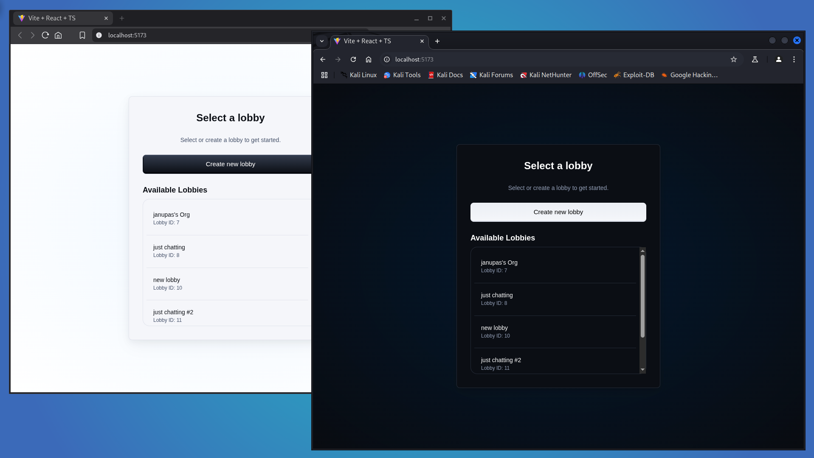
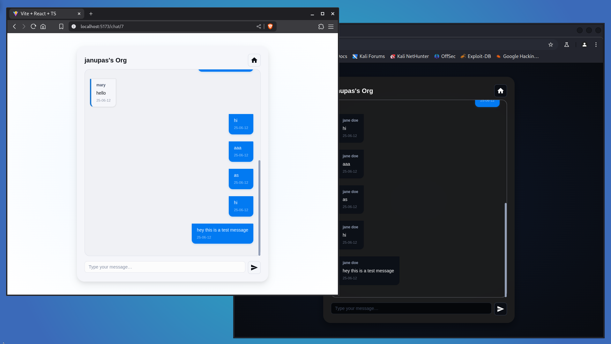
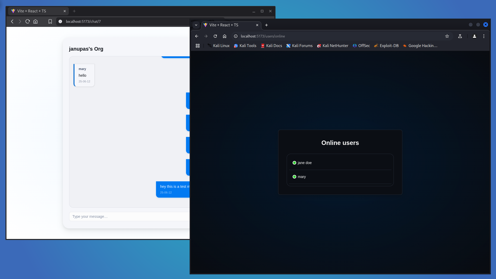
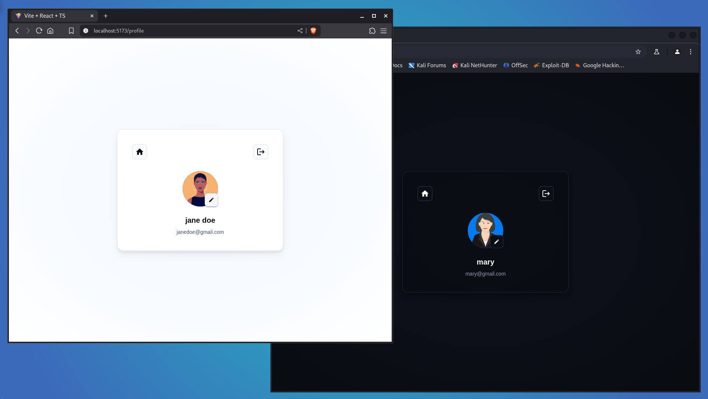
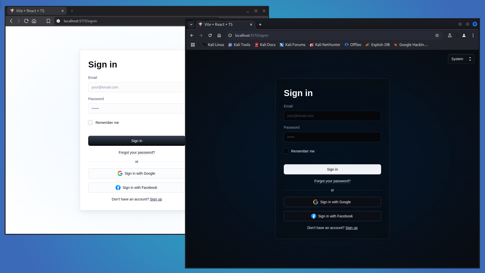

# General Information

This project is Beagle V2. A simple chat application. A lot of room for improvements. Lots of errors and bad mistakes too.

# Technologies

Project is created with:

- Frontend - Vite, React JS, Typescript, Material UI
- Backend - Nodejs, Express, Typescript, Socket-io, Prisma

# Images

 <h3>Lobby Page</h3>

 <h3>Chat Page</h3>

 <h3>Online users</h3>

 <h3>Profile Page</h3>

 <h3>Auth Page</h3>

